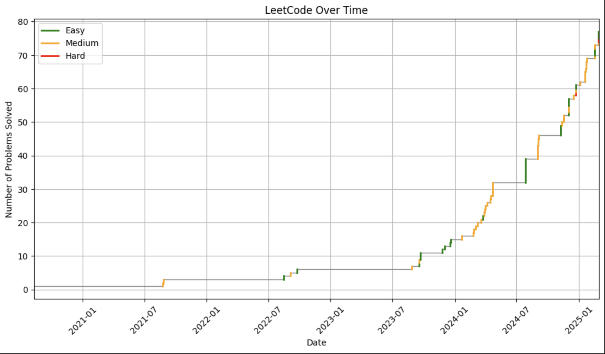

# LeetCode Analytics

Track and visualize your LeetCode problem-solving progress over time. For some reason, LeetCode doesn't have a built-in way to do this.



## Setup

1. Clone repository and create virtual environment:
   ```
   git clone https://github.com/yourusername/leetcode-analytics.git
   cd leetcode-analytics
   python3 -m venv .venv
   source .venv/bin/activate  # On Windows: .venv\Scripts\activate
   ```

2. Install requirements:
   ```
   pip install -r requirements.txt
   ```

## Authentication

You need to extract authentication data from your LeetCode account:

1. Log in to LeetCode in your browser
2. Open Developer Tools (F12) → Network tab
3. Refresh the page
4. Click any leetcode.com/graphql request (navigate to the profile page)
5. Find and copy:
   - The `cookie` header value
   - The `x-csrftoken` header value

6. Populate `auth.py` with the values

Note: Keep your auth.py private - it contains your LeetCode credentials. 

## Running

1. Start Jupyter:
   ```
   jupyter notebook
   ```

2. Open `chart.ipynb` and run all cells

## Features

- Fetches your solved LeetCode problems
- Retrieves submission dates
- Generates charts showing progress over time